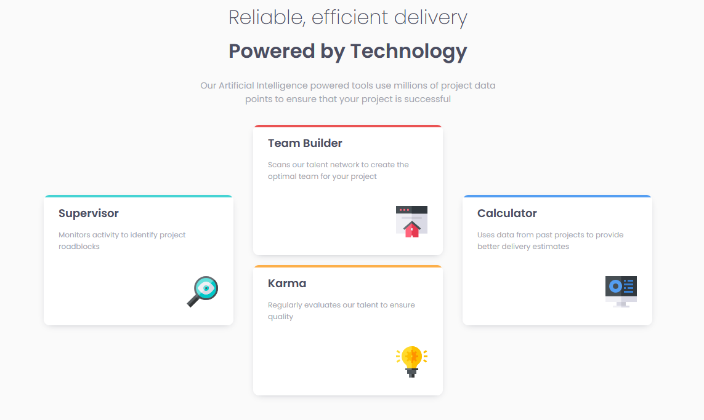
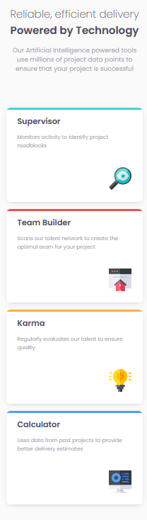
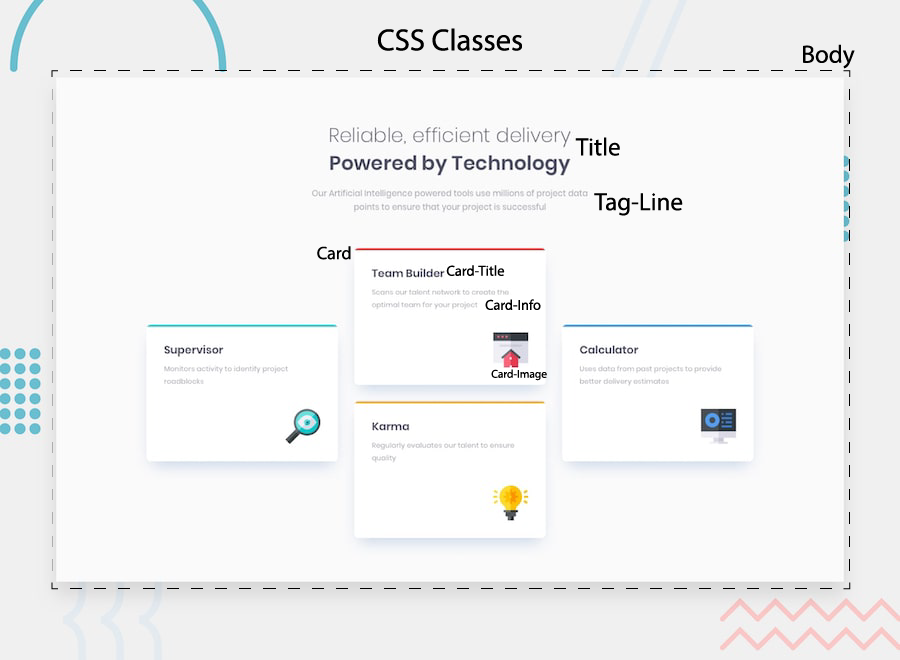
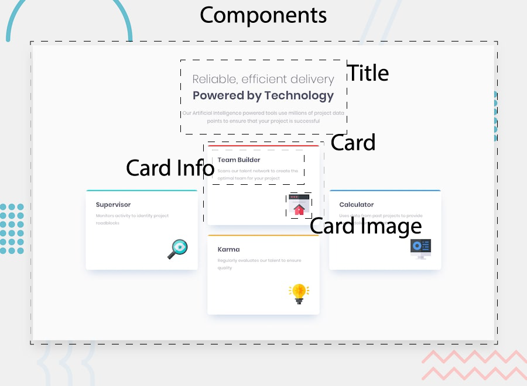

# Frontend Mentor - Four card feature section solution

This is a solution to the [Four card feature section challenge on Frontend Mentor](https://www.frontendmentor.io/challenges/four-card-feature-section-weK1eFYK). Frontend Mentor challenges help you improve your coding skills by building realistic projects. 

## Table of contents

- [Overview](#overview)
  - [The challenge](#the-challenge)
  - [Screenshot](#screenshot)
  - [Links](#links)
- [My process](#my-process)
  - [Built with](#built-with)
  - [What I learned](#what-i-learned)
- [Author](#author)

## Overview

### The challenge

Users should be able to:

- View the optimal layout for the site depending on their device's screen size

### Screenshot






### Links

- Solution URL: [Solution](https://github.com/a-dri-an-S/Four-Card-Features)
- Live Site URL: [Live Site](https://elastic-shockley-cf67e7.netlify.app/)

## My process
- Create outline for CSS classes and React components
- Add assets and create components
- Add data/content
- Add mobile styles
- Add desktop styles

### Built with

- Semantic HTML5 markup
- CSS custom properties
- Flexbox
- Mobile-first workflow
- [React](https://reactjs.org/) - JS library

### What I learned

I learned how to use linear gradient to apply multiple colors to a single object

```css
.card-cyan {
  background: linear-gradient(0deg, white 98%, var(--cyan) 10%);
}
.card-red {
  background: linear-gradient(0deg, white 98%, var(--red) 10%);
}
.card-orange {
  background: linear-gradient(0deg, white 98%, var(--orange) 10%);
}
.card-blue {
  background: linear-gradient(0deg, white 98%, var(--blue) 10%);
}
```

## Author

- Frontend Mentor - [@yourusername](https://www.frontendmentor.io/profile/yourusername)